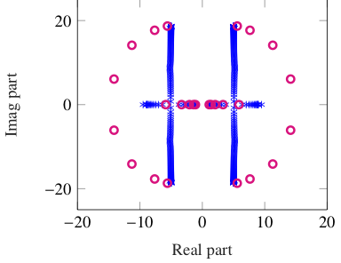
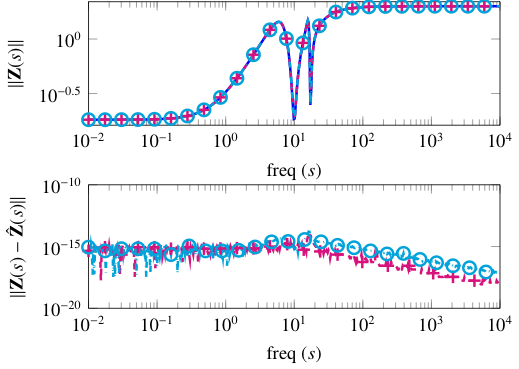

## Identification of Port-Hamiltonian Systems using Frequency Response Data

This repository contains a MATLAB/OCTAVE implementation of an algorithm to identifying an underlying port-Hamiltonian systems using frequency response data. The approach was proposed in [1]:
<center>


</center>

## Overview of the Approach
We aim at constructing a linear port-Hamiltonian systems of the form 
<center>
<p align="center"></p>
 </center>
 where system matrices e.g. J, R have special properties that lead to the system having intrisic properties such as passivity, stability. Our goal is learn such systems given frequency response measurements. In the following, we summerize the steps to identify such a system:
 
 * Collect frequency response measurements.
 * Construct a state-space model using the [Loewner method](https://www.sciencedirect.com/science/article/pii/S0024379507001280).
 * Compute spectral zeros and zero directions of the constructed state-space model. 
 * Using these spectral zero and zero directions, we determine new qualities. Based on these quantities, we can determine a state-space model in the form that is shown above. For more details, we refer to our paper.

## Function
```
[IdenpHModel,out] = Construct_pHModel(w,F,D,tol)
```
***Arguments***

* `w` 	- frequency points
* `F` 	- transfer function values at w
* `D` 	- direct feed-through term
* `tol` (optional) 	- truncation tolerance for the loewner pencil, determing the order of the identified model. Its default value is 1e-8.

***Return values***

* `IdenpHModel` - Identified underlying port-Hamiltonian realization. It is a struct, containing system matrics and the transfer function of the port-Hamiltonian system
* `out` - Additional information --> the spectral zeros of the identified port-Hamiltonian system, and the intermediate identified Loewner model. 


## Examples 
The `Examples` folder contains three examples. These examples are considered in the paper [[1]](https://arxiv.org/pdf/1911.00080.pdf) and one can reproduce the result reported in the paper by simply running these examples.

## Cite As
Please cite the paper [[1]](https://arxiv.org/pdf/1911.00080.pdf) if you use the function `Construct_pHModel` in your research work.
<details><summary> BibTeX </summary><pre>
@TechReport{morBenGVP19,
author = {Benner, P. and and Goyal, P., and Van Dooren, P.},
title = {Identification of Port-{H}amiltonian Systems from Frequency Response Data },
institution = {arXiv},
year = 2019,
type = {e-prints},
number = {1911.00080},
note = {math.NA},
url = {https://arxiv.org/abs/1911.00080}
}</pre></details>


## References
[1]. Benner, P., Goyal, P., and Van Dooren, P., Identification of Port-Hamiltonian Systems from Frequency Response Data, arXiv:1911.00080, 2019.

[2]. Mayo, A. J., and Antoulas, A. C., A framework for the solution of the generalized realization problem, Linear Algebra Appl. 425 (2-3) (2007) 634–662.
 
___

This script has been written in MATLAB 2016. We like to thank A. C. Antoulas and A. C. Ionita for providing their Loewner framework implementation.  Please contact [Pawan Goyal](goyalp@mpi-magdeburg.mpg.de) for any queries and comments. 


